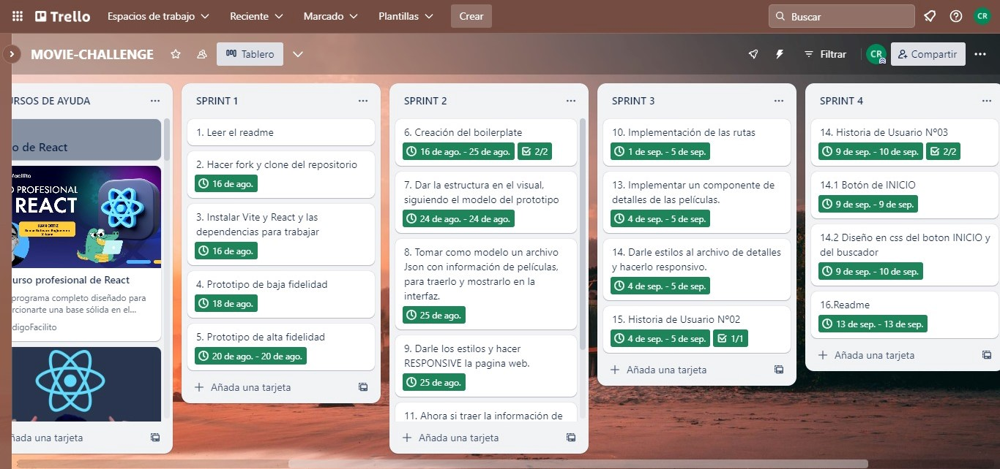
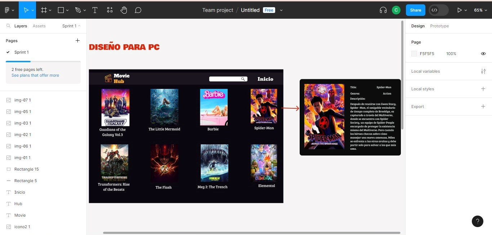
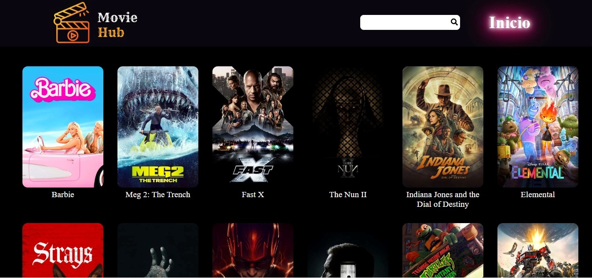
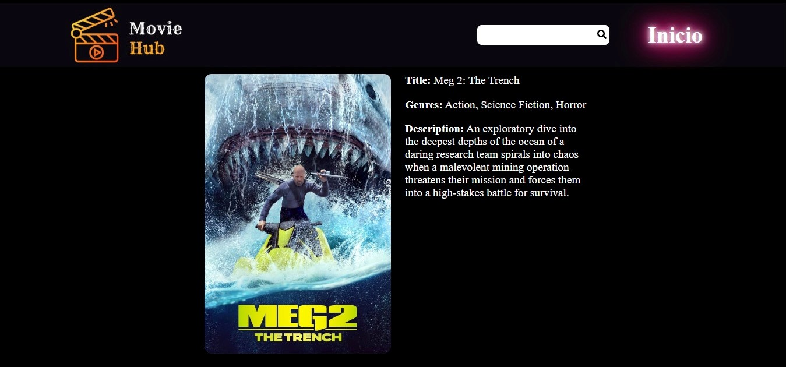
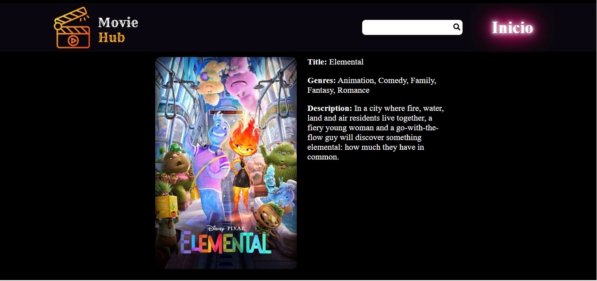
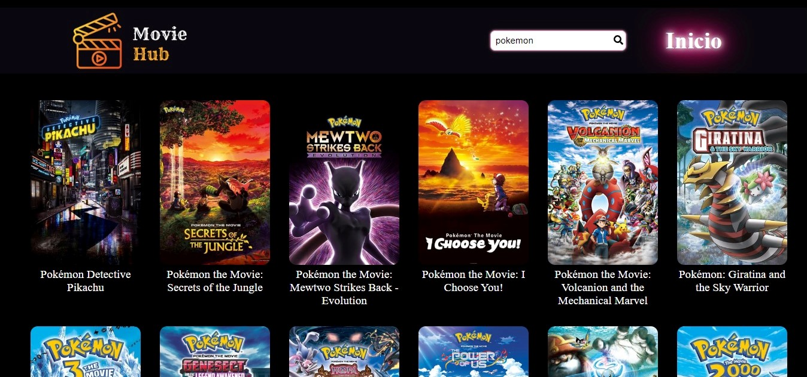
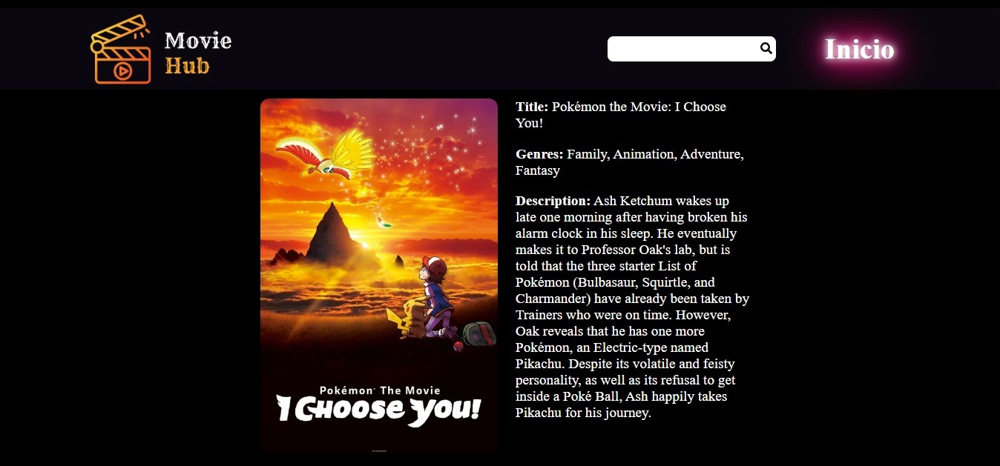

# Movie-challenge con Framework

## Índice

- [1. Preámbulo](#1-preámbulo)
- [2. Resumen del proyecto](#2-resumen-del-proyecto)
- [3. Organización](#3-organizacion)
- [4. Historias de usuario](#4-historias-de-usuario)
- [5. Diseños de la interfaz de usurio](#5-diseño-de-la-interfaz-de-usuario)
- [6. Desarrollo del proyecto](#6-desarrollo-del-proyecto)
- ***

## 1. Preámbulo

La manera en que vemos películas ha cambiado radicalmente durante los últimos años debido, en parte, a la aparición de los servicios de streaming que nos permiten hacerlo desde donde estemos y en cualquier momento. El mejor reflejo de este fenómeno es el éxito de Netflix, HBO y Disney+, etc.

Creemos que hay una gran oportunidad de proponer productos/experiencias innovadoras de todo tipo utilizando datos de películas (directorxs, actorxs, sagas, secuelas, fechas, etc.). Podríamos pensar en juegos, comunidades, catálogos, recomendaciones basadas en gustos personales, etc. (sólo por mencionar algunas ideas obvias).

## 2. Resumen del proyecto

El objetivo de aprendizaje de este proyecto fue diseñar y construir una interfaz web donde se pueda visualizar y traer data de una API (TMDB), entendiendo primeramente las necesidades del usuario.

Nuestro producto final es una página web que permite visualizar una lista de películas top, además cuenta con un buscador que permite encontrar películas por su nombre.

## 3. Organizacion

Como herramienta de organización utilicé [Trello], en donde hice toda la planeación de trabajo de cada sprint que duró este proyecto (4):

## 4. Historias de usuario

Para las historias de usuario me basé principalmente en las necesidades para los usuarios y las complementé con los usuarios a los que consulté y recibí feedback, de las cuales consideré 3 historiasde usuario para trabajar este proyecto.

1. Como usuario, quiero entrar a la aplicación y ver una lista de todas las películas mas top y que cuente con un buscador para encontrar las películas preferidas..
2. Como usuario, quiero ver una pequeña descripción de cada película y al genero que pertenece.
3. Como usuario quiero poder buscar las películas que yo quiera por sus nombres y que la aplicación sea fácil de usar y tenga una interfaz intuitiva y agradable y que lo pueda ver también desde mi celular.

## 5. Diseño de la Interfaz de Usuario

#### Prototipo de alta fidelidad:

El prototipo de alta fidelidad lo desarrollé en [Figma](https://www.figma.com/file/N7Rmlj9BIobdLKdh9mMtEA/Untitled?type=design&node-id=0-1&mode=design&t=wMpfFPVpsm0vxq0H-0).

## 6. Desarrollo del Proyecto

**1. Home del proyecto:**

El proyecto inicia en esta página, en donde tienes toda la lista de las peliculas top, un buscador y un boton de Inicio, cabe mencionar que la lista de peliculas se ha traido desde la API(TMDB) y se ha trabajado con la librería[React](https://react.dev/).

**2. Detalles:**

Al dar clic o tocar en la imagen de cada película, te llevará a otra pagina donde podras ver el título de la película, el género y una pequeña descripción.

**3. Buscador:**

Aquí se puede escribir el nombre de la película que se quiere encontrar y al dar enter o tocar el ícono de la lupita, te mostrará todas las películas que coincidan con ese nombre.

De igual manera si tocamos en cada imagen nos mostrará los detalles de la película:

**4. Boton-Inicio:**

Se ha implementado este botón para poder regresar atrás sin tener que toc ar la flecha que aparece en la página.
